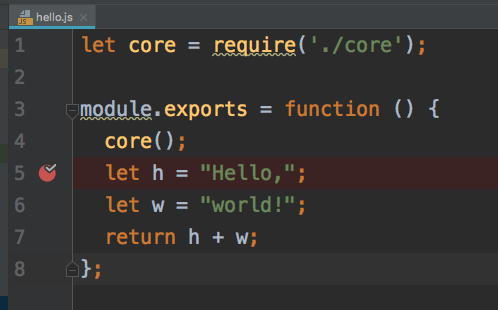
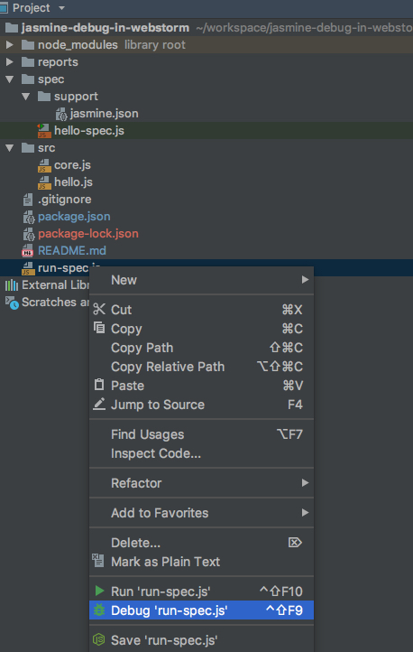
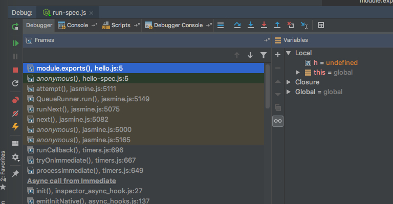

JavaScript Jasmine Debugging in WebStorm Demo
=============================================

```
npm install
```

在Webstorm中，我们可以以“单步调试”的方式运行Jasmine测试代码。

设置断点
----

先在Webstorm中，对代码设置断点：



以debug模式运行测试文件
--------------

但是需要注意的是，直接在测试文件（如`hello-spec.js`）上执行单步调试是不行的，会报错：

```
Debugger attached.
/Users/freewind/workspace/jasmine-debug-in-webstorm/spec/hello-spec.js:3
describe("A suite", function () {
^

ReferenceError: describe is not defined
```

我们需要手动创建一个文件，做一些初始化工作，参见：`run-spec.js`。

然后以debug方式运行`run-spec.js`:





然后就可能尽情调试了。